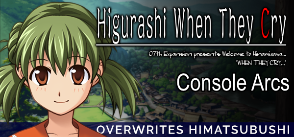
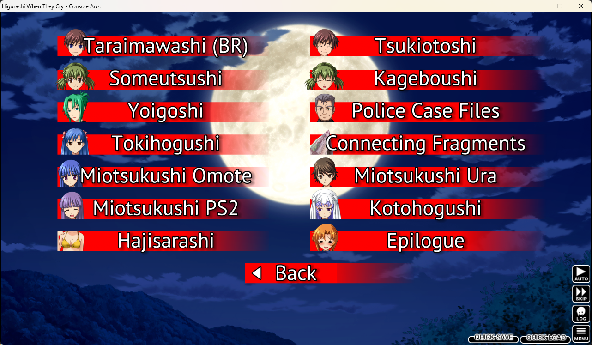

# Higurashi no Naku Koro ni - Arcos de Console

Tradução para os arcos de console de Higurashi no Naku Koro ni.

## Progresso

|Arco           |Tradução |Edição|Revisão|
|---------------|---------|------|-------|
|Taraimawashi   |100%     |100%  |100%   |
|Someutsushi    |58%      |0%    |0%     |

## Instalação

> [!WARNING]
> É necessário ter o Capítulo 4: Himasubushi instalado.
> O patch converterá seu jogo e apenas os arcos listados acima poderão ser jogados.

1. Baixe e abra o [instalador do 07th-mod](https://github.com/07th-mod/python-patcher/releases/latest/download/07th-Mod.Installer.Windows.exe).
2. Selecione a última opção chamada _Console Arcs_.  
3. Selecione o diretório onde seu Himatsubushi está instalado e clique em "_START UPDATE!_".
4. Após a instalação ser finalizada, baixe a [versão mais recente da tradução](https://github.com/0Mateus/higurashi-console-arcs/releases/latest/download/Higurashi-console-arcs_PT-BR.7z) e substitua os arquivos na pasta do jogo.
5. Abra o jogo e verifique se o arco que deseja jogar aparece como (_BR_) na tela de seleção.   

## Créditos

[0Mateus](https://github.com/0Mateus) - Tradução

[kikachangames](https://github.com/kikachangames) - Revisão e Quality Check

[rosalina](https://x.com/gothitellle) - Revisão

[07th-Mod](https://07th-mod.com/) - Port e tradução para inglês de todos os arcos de console
